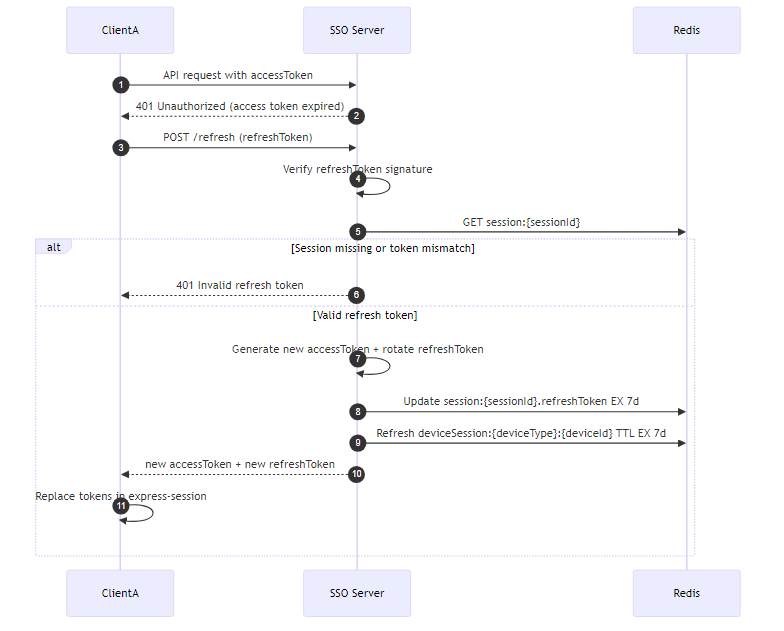
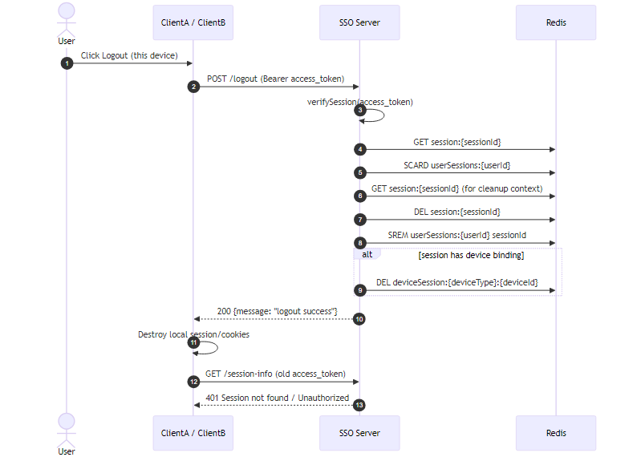
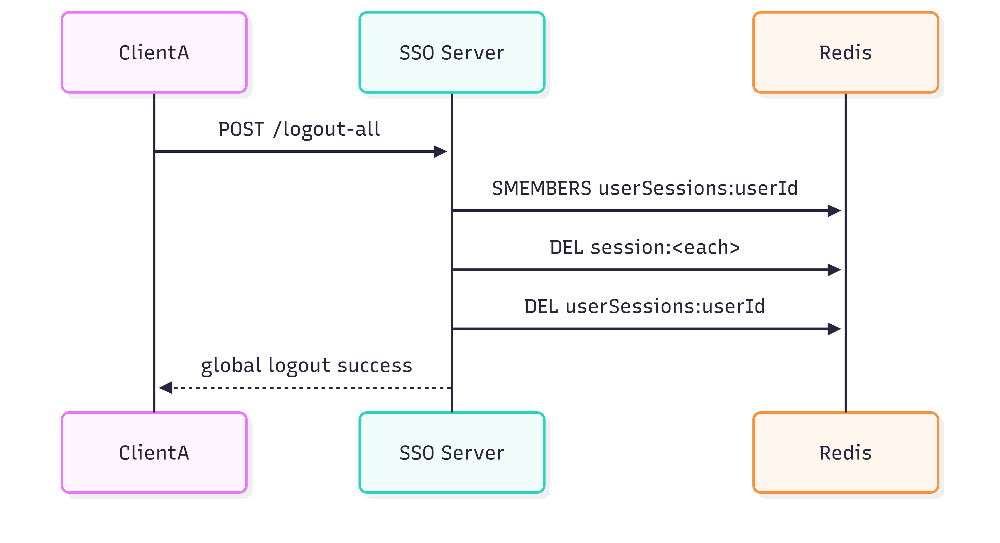

# SSO Project (OAuth2 + OIDC + PKCE)

โปรเจกต์นี้ประกอบด้วย 3 ระบบหลัก:

1. `sso-server` เป็น Authorization Server/OIDC Provider
2. `clientA` เป็น OAuth/OIDC client แบบ custom flow
3. `clientB` เป็น OAuth/OIDC client ผ่าน `passport-oauth2`

รองรับ authorization code flow, refresh token, OIDC (`openid email profile`), JWKS discovery, local logout และ global logout

## Diagram






## Architecture Overview

### 1) SSO Server (`sso-server`)

- User registration: `POST /register`
- OAuth client registration (admin key): `POST /register-oauth-client`
- Authorization endpoint: `GET /authorize`
- Token endpoint: `POST /token` (`authorization_code`, `refresh_token`)
- Session validation: `GET /session-info`
- UserInfo: `GET /userinfo`
- Logout: `POST /logout`, `POST /logout-all`
- OIDC discovery/JWKS:
  - `GET /.well-known/openid-configuration`
  - `GET /.well-known/jwks.json`

### 2) ClientA (`clientA`)

- `/login` = OAuth login
- `/login-oidc` = OIDC login (`openid email`)
- `/callback` แลก code เป็น token พร้อม PKCE
- เก็บ token ใน `express-session`
- auto refresh token เมื่อ upstream ตอบ 401

### 3) ClientB (`clientB`)

- `/login` = OAuth login ผ่าน Passport
- `/login-oidc` = OIDC login (`openid email profile`)
- แลก code ผ่าน `passport-oauth2` + PKCE
- เก็บ user/token ใน passport session
- auto refresh token และ re-sync session กับ SSO

### 4) ClientC (`clientC`)

- `/login` = OIDC login ผ่าน `openid-client`
- แลก code ผ่าน `openid-client` + PKCE
- เก็บ user/token ใน `express-session`
- auto refresh token และ re-sync session กับ SSO

## Data Model และ Redis Keys

### Redis (SSO)

- `session:<sessionId>`
- `userSessions:<userId>` (Set ของ sessionId)
- `deviceSession:<deviceType>:<deviceId>`
- `sess:<expressSessionId>` (session ของ SSO login page)

ตัวอย่าง `session:<sessionId>`:

```json
{
  "sub": "user-sub",
  "userId": "mongo-user-id",
  "clientId": "oauth-client-id",
  "scope": "openid email",
  "nonce": "optional-nonce",
  "authTime": "2026-03-09T00:00:00.000Z",
  "deviceId": "browser-id",
  "deviceType": "browser",
  "refreshToken": "jwt",
  "isActive": true
}
```

### MongoDB

- `User`: `sub`, `email`, `password`, `name`, `givenName`, `familyName`, `picture`, ...
- `AuthCode`: `code`, `userId`, `clientId`, `redirectUri`, `scope`, `nonce`, `codeChallenge`, `consumedAt`, ...
- `OAuthClient`: `clientId`, `clientSecret(hash)`, `redirectUris`, `allowedScopes`, `grantTypes`, `tokenEndpointAuthMethod`

## Quick Start

## 1. Prerequisites

- Node.js 18+ (แนะนำ LTS)
- MongoDB
- Redis

## 2. Install dependencies

รันในแต่ละโฟลเดอร์:

```bash
cd sso-server && npm install
cd ../clientA && npm install
cd ../clientB && npm install
```

## 3. Configure environment variables

### `sso-server/.env`

คัดลอกจาก `sso-server/.env.example` และเติมค่าให้ครบ

```env
MONGODB_URI=mongodb://localhost:27017/sso_project
NODE_ENV=development
SSO_SECRET=replace-me
ACCESS_SECRET=replace-me
REFRESH_SECRET=replace-me
ADMIN_API_KEY=replace-me
ISSUER=http://localhost:4000
OIDC_PRIVATE_KEY_PATH=./keys/oidc-private.pem
OIDC_PUBLIC_KEY_PATH=./keys/oidc-public.pem
OIDC_KID=sso-key-1
REDIS_URL=redis://localhost:6379
SALT_ROUNDS=10
PORT=4000
```

หมายเหตุ: key files มีอยู่แล้วที่ `sso-server/keys/oidc-private.pem` และ `sso-server/keys/oidc-public.pem`

### `clientA/.env`

```env
NODE_ENV=development
APP_SESSION_SECRET=replace-me
CLIENT_ID=replace-after-register-client
CLIENT_SECRET=replace-after-register-client
SSO_SERVER=http://localhost:4000
REDIRECT_URI=http://localhost:5000/callback
REDIS_URL=redis://localhost:6379
PORT=5000
```

### `clientB/.env`

```env
NODE_ENV=development
APP_SESSION_SECRET=replace-me
CLIENT_ID=replace-after-register-client
CLIENT_SECRET=replace-after-register-client
SSO_SERVER=http://localhost:4000
REDIRECT_URI=http://localhost:5002/callback
REDIS_URL=redis://localhost:6379
PORT=5002
```

## 4. Start services

เปิด 3 terminals แล้วรัน:

```bash
cd sso-server && npm run dev
cd clientA && npm run dev
cd clientB && npm run dev
```

## 5. Register OAuth clients

ต้อง register ให้ `redirect_uri` ตรงกับแต่ละ client ก่อน

ตัวอย่างสำหรับ ClientA:

```bash
curl -X POST http://localhost:4000/register-oauth-client \
	-H "Content-Type: application/json" \
	-H "x-admin-api-key: <ADMIN_API_KEY>" \
	-d '{
		"name": "clientA",
		"redirectUris": ["http://localhost:5000/callback"],
		"tokenEndpointAuthMethod": "client_secret_post",
		"allowedScopes": ["openid", "email", "profile"],
		"grantTypes": ["authorization_code", "refresh_token"]
	}'
```

ตัวอย่างสำหรับ ClientB:

```bash
curl -X POST http://localhost:4000/register-oauth-client \
	-H "Content-Type: application/json" \
	-H "x-admin-api-key: <ADMIN_API_KEY>" \
	-d '{
		"name": "clientB",
		"redirectUris": ["http://localhost:5002/callback"],
		"tokenEndpointAuthMethod": "client_secret_post",
		"allowedScopes": ["openid", "email", "profile"],
		"grantTypes": ["authorization_code", "refresh_token"]
	}'
```

นำ `client_id` และ `client_secret` ที่ได้ไปใส่ใน `.env` ของแต่ละ client

## 6. Register user สำหรับทดสอบ

```bash
curl -X POST http://localhost:4000/register \
	-H "Content-Type: application/json" \
	-d '{
		"email": "demo@example.com",
		"password": "Demo#1234",
		"name": "Demo User",
		"givenName": "Demo",
		"familyName": "User",
		"picture": "https://example.com/avatar.png"
	}'
```

## Flow สรุปแบบสั้น

1. Client redirect ไป `GET /authorize` พร้อม PKCE (`code_challenge`)
2. SSO login สำเร็จแล้ว redirect กลับพร้อม `code`
3. Client ส่ง `POST /token` (`authorization_code`) + `code_verifier`
4. SSO คืน `access_token`, `refresh_token` และ `id_token` เมื่อ scope มี `openid`
5. เมื่อ access token หมดอายุ client ใช้ `POST /token` (`refresh_token`) เพื่อหมุน refresh token
6. `POST /logout` ลบ session ปัจจุบัน, `POST /logout-all` ลบทุกอุปกรณ์

## Smoke Test

ใช้สคริปต์ `smoke_test.js` ตรวจ flow สำคัญของทั้ง ClientA/ClientB

```bash
node smoke_test.js
```

รายละเอียด expected result ดูที่ `SMOKE_TEST.md`

## OIDC Metadata

- Discovery: `GET http://localhost:4000/.well-known/openid-configuration`
- JWKS: `GET http://localhost:4000/.well-known/jwks.json`
- ID Token algorithm: `RS256`
